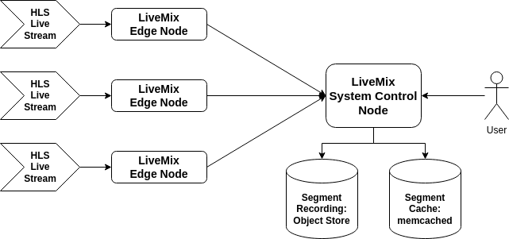
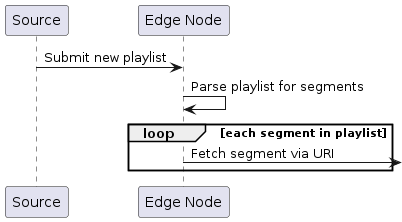
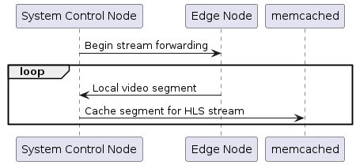
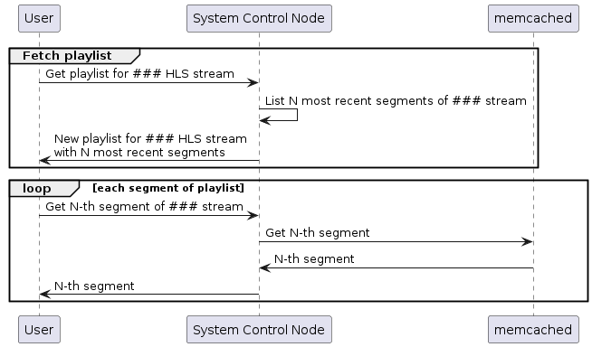
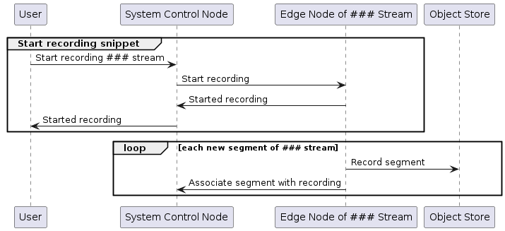
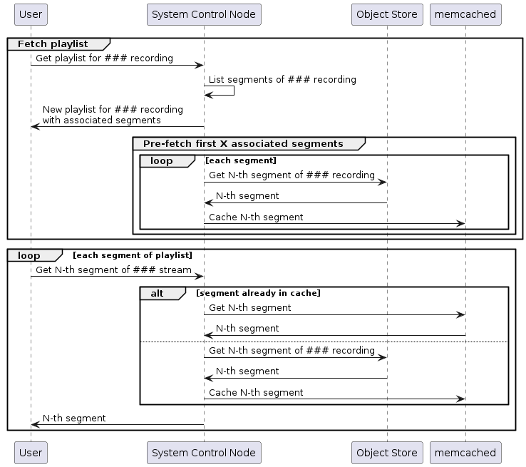

# LiveMix - A Minimalist HLS Proxy

`LiveMix` is a streamlined HLS proxy created to facilitate HLS broadcasting from disparate edge devices over the web. Employing a client-server architecture, a `LiveMix` edge node receives an HLS stream and forwards it to the system control node, functioning as a caching proxy. Users can directly view HLS streams from the system control node, and if desired, record snippets of any stream for future replay.

**References:**
* [HTTP Live Streaming](https://en.wikipedia.org/wiki/HTTP_Live_Streaming)
* [HLS Streaming: What is it, How it works & When to use it](https://www.100ms.live/blog/hls-streaming)

# Key Features

* Proxy live video feeds, accessible exclusively within a LAN, over the internet without opening up the firewall.

* Record snippets of video feeds, and replay previously recorded snippets.

* No transcoding within the pipeline, so can operate with constrained compute resources.

# Overview



## Live Video Feed

The `LiveMix` system consists of edge nodes and a system control node. The `LiveMix` edge node is the system's input. It captures a HLS via push.



A source, such as `ffmpeg`, submits new HLS playlists to the edge node.

```
ffmpeg \
  ... \
  -f hls \
  ... \
  -headers $'Video-Source-Name: camera-0\r\nMPEG-TS-URI-Prefix: file:///path/to/segments\r\n'
  -method POST http://livemix-edge-node/v1/playlist
```

Upon processing the new playlist, the edge node will retrieve the segments mentioned in the playlist using their URIs and store them locally. The segment URI is constructed based on `MPEG-TS-URI-Prefix + segment file name`.

> **NOTE:** Only file system based segment fetch is currently implemented.

The edge node does not automatically forward the stored segments, but requires a command from the system control node. Upon receiving the command, the edge node will start forwarding the stored segments to the system control node, which will then cache them in `memcached` with a TTL.



When a user wants to view a specific HLS stream, they follow standard HLS fetch procedures. Beginning with the playlist, the system control node return a new playlist based on the most recent segments of that stream. When the user queries for the mentioned segments, the system control node returns the cached entries from `memcached`.



> **NOTE:** The number of segments to include in the playlist is configurable, and impacts the segment caching TTL; longer playlists requires larger TTL.

## Stream Recording And Replay

A user has the capability to record snippets from an ongoing HLS stream. By requesting the system to initiate a recording of a specific stream through the system control node, the corresponding edge node begins forwarding newly observed segments to the object store. Simultaneously, it notifies the system control node to associate those segments with the ongoing recording.



To replay a previous recording, a user follows a process similar to viewing a live stream. Unlike watching a live stream though, the source of the segments is the object store. At the start of the replay, the system control node pre-fetches segments from the store to prime the cache. As the replay progresses, additional segments are copied from the store to the cache.



# Getting Started

`LiveMix` uses Google `PubSub` for communication between the edge nodes and the system control node. So before starting, user must acquire a GCP service account credential file. Place the file at `tmp/gcp-creds.json`. This file will be referenced in the following steps.

> **NOTE:** Please refer to GCP documentation for procedures to generate this credential file.

## Start Demo System Control Node

Copy [ref/example-control-node-docker-cfg.yaml](ref/example-control-node-docker-cfg.yaml) to `tmp/system-control-node-cfg.yaml`, and update the following fields with appropriate values.

* `management.requestResponse.gcpProject`: GCP project name.
* `management.requestResponse.self.topic`: `PubSub` topic the system control node subscribes to for IPC requests.
* `broadcast.pubsub.topic`: `PubSub` topic for `LiveMix` system event messages.

Now, start the system control node.

```
make up
```

The following containers will start

```
$ docker ps
CONTAINER ID   IMAGE                                              COMMAND                  CREATED          STATUS          PORTS                                                NAMES
78bad90f9407   alwitt/livemix:latest                              "/usr/bin/livemix.bi…"   43 minutes ago   Up 43 minutes   127.0.0.1:8080-8081->8080-8081/tcp                   livemix-system-ctrl-node
92a8dcd68201   postgres:15                                        "docker-entrypoint.s…"   45 minutes ago   Up 45 minutes   127.0.0.1:5432->5432/tcp                             livemix-ctrl-db
353641c21be9   quay.io/minio/minio:RELEASE.2023-07-07T07-13-57Z   "/usr/bin/docker-ent…"   45 minutes ago   Up 45 minutes   127.0.0.1:9000->9000/tcp, 127.0.0.1:9090->9090/tcp   livemix-ctrl-minio
31b4f722a303   memcached:1.6.20-alpine                            "docker-entrypoint.s…"   45 minutes ago   Up 45 minutes   8080/tcp, 11211/tcp, 127.0.0.1:18080->18080/tcp      livemix-ctrl-memcached
```

## Start Demo Edge Node

Copy [ref/example-edge-node-docker-cfg.yaml](ref/example-edge-node-docker-cfg.yaml) to `tmp/edge-node-cfg.yaml`, and update the following fields with appropriate values.

* `requestResponse.gcpProject`: GCP project name.
* `requestResponse.self.topic`: `PubSub` topic the edge node subscribes to for IPC requests.
* `requestResponse.systemControlTopic`: `PubSub` topic the system control node subscribes to for IPC requests. This must match `management.requestResponse.self.topic` in `tmp/system-control-node-cfg.yaml`.
* `broadcast.pubsub.topic`: `PubSub` topic for LiveMix system event messages. This must match `broadcast.pubsub.topic` in `tmp/system-control-node-cfg.yaml`.

Before starting the edge node, create an associated video source entry in the system control node.

```
curl -v -X POST http://127.0.0.1:8080/v1/source -d '{"name": "test-video", "description": "Test video source", "segment_len": 4}' | jq '.'
```

The response should be similar to

```json
{
  "success": true,
  "request_id": "4c8f7ea9-d13e-4dfd-80d5-d76f0a9fc2b3",
  "source": {
    "id": "ae47e08c-25e7-4a75-92ad-06c43fa92b58",
    "name": "test-video",
    "segment_length": 4,
    "description": "Test video source",
    "streaming": -1,
    "local_time": "0001-01-01T00:00:00Z",
    "created_at": "2024-01-07T02:06:44.990949Z",
    "updated_at": "2024-01-07T02:06:44.990949Z"
  }
}
```

Now, start the edge node.

```
make up-edge
```

The following containers will start

```
$ docker ps
CONTAINER ID   IMAGE                     COMMAND                  CREATED          STATUS          PORTS                                 NAMES
74cb2e4b969c   alwitt/livemix:latest     "/usr/bin/livemix.bi…"   29 seconds ago   Up 28 seconds   127.0.0.1:9080-9081->9080-9081/tcp    livemix-edge-node
```

## Generate Input HLS Stream

`ffmpeg` is used to generate the HLS source test stream. Before starting, acquire a video file for the test. Create the DIR `tmp/video`, and place the test video file at `tmp/video/{{ video file name }}`. Use the following `ffmpeg` command to start the stream.

```
cd tmp/video && \
ffmpeg \
  -stream_loop -1 \
  -re \
  -i {{ video file name }} \
  -c:v libx264 \
  -crf 21 \
  -preset veryfast \
  -g 30 \
  -an \
  -sc_threshold 0 \
  -strftime 1 \
  -f hls \
  -hls_time 4 \
  -hls_list_size 5 \
  -hls_flags delete_segments+independent_segments \
  -hls_segment_filename 'test-video-%s.ts' \
  -headers $'Video-Source-Name: test-video\r\nMPEG-TS-URI-Prefix: file:///opt/livemix/video\r\n' \
  -method POST http://127.0.0.1:9080/v1/playlist
```

Following the edge node logs, user would see messages similar to this, which indicates the edge node is consuming the newly generated video segments.

```
info Purged [1] expired video segments. [15] remain in cache component=video-segment-cache file=cache.go func=github.com/alwitt/livemix/utils.(*inProcessSegmentCacheImpl).purgeExpiredEntry instance=in-process line=282 module=utils
```

## View Live Stream From System Control Node

Once the edge node is consuming the source HLS stream, user is ready to start the forwarding process to the system control node.

First, acquire the ID of the edge node.

```
curl http://127.0.0.1:8080/v1/source | jq '.'
```

```json
{
  "success": true,
  "request_id": "c9881d26-1494-425d-9b6b-0ef0e881cdc0",
  "sources": [
    {
      "id": "ae47e08c-25e7-4a75-92ad-06c43fa92b58",
      "name": "test-video",
      "segment_length": 4,
      "description": "Test video source",
      "streaming": -1,
      "rr_target": "local-dev-edge-node",
      "local_time": "2024-01-07T03:06:07.776757Z",
      "created_at": "2024-01-07T02:06:44.990949Z",
      "updated_at": "2024-01-07T03:06:07.964087Z"
    }
  ]
}
```

Then, start streaming on this edge node.

```
curl -v -X PUT 'http://127.0.0.1:8080/v1/source/ae47e08c-25e7-4a75-92ad-06c43fa92b58/streaming?new_state=true' | jq '.'
```

User can now view the live stream from the system control node. This indicates the data plane is fully functional end-to-end.

```
ffplay http://127.0.0.1:8081/v1/vod/live/ae47e08c-25e7-4a75-92ad-06c43fa92b58/vid.m3u8
```

## Record And Replay Live Stream Snippets

Before starting, user must prepare the object store to capture recording segments. We will use [mc (Minio Client)](https://min.io/docs/minio/linux/reference/minio-mc.html) to operate the object store.

First, create an alias for the object store in `mc`'s config.

```
mc alias set livemix-lcl-dev http://localhost:9000 root password
```

Then create the bucket for the recording segments.

```
mc mb livemix-lcl-dev/livemix
```

Now, user can start a new snippet recording with

```
curl -v -X POST http://localhost:8080/v1/source/ae47e08c-25e7-4a75-92ad-06c43fa92b58/recording -d '{"start_time_epoch": ###}' | jq '.'
```

The `start_time_epoch` control the starting point in time for the recording. The edge node maintains a cache of previously seen segments, so any segments which is newer then this timestamp will be a part of the recording.

The response provides the recording ID.

```json
{
  "success": true,
  "request_id": "7b1945c2-bfbc-4ed8-9e4f-10eef7a1f895",
  "recording": {
    "id": "01HKH0STT34SSRFG6EPS458X0T",
    "source": "ae47e08c-25e7-4a75-92ad-06c43fa92b58",
    "start_ts": "2024-01-07T03:51:43Z",
    "end_ts": "0001-01-01T00:00:00Z",
    "active": 1,
    "created_at": "2024-01-07T03:52:26.691237Z",
    "updated_at": "2024-01-07T03:52:26.691237Z"
  }
}
```

User stops the recording with

```
curl -X POST http://localhost:8080/v1/recording/01HKH0STT34SSRFG6EPS458X0T/stop | jq '.'
```

To view the recording, user calls

```
ffplay http://127.0.0.1:8081/v1/vod/recording/01HKH0STT34SSRFG6EPS458X0T/vid.m3u8
```

# License

* `LiveMix` source is licensed under the [MIT License](./LICENSE)
