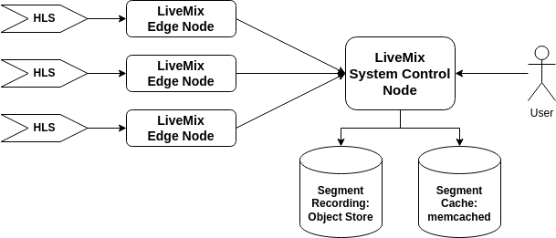

# LiveMix - A Minimalist HLS Proxy

`LiveMix` is a streamlined HLS proxy created to facilitate HLS broadcasting from disparate edge devices over the web. Employing a client-server architecture, a `LiveMix` edge node receives an HLS stream and forwards it to the system control node, functioning as a caching proxy. Users can directly view HLS streams from the system control node, and if desired, record snippets of any stream for future replay.

**References:**
* [HTTP Live Streaming](https://en.wikipedia.org/wiki/HTTP_Live_Streaming)
* [HLS Streaming: What is it, How it works & When to use it](https://www.100ms.live/blog/hls-streaming)

# Key Features

* Proxy live video feeds, accessible exclusively within a LAN, over the internet without opening up the firewall.

* Record snippets of video feeds, and replay previously recorded snippets.

* No transcoding within the pipeline, so can operate with constrained compute resources.

# Overview



## Live Video Feed

The `LiveMix` system consists of edge nodes and a system control node. The `LiveMix` edge node is the system's input. It captures a HLS via push.


A source, such as `ffmpeg`, submits new HLS playlists to the edge node.

```
ffmpeg \
  ... \
  -f hls \
  ... \
  -headers $'Video-Source-Name: camera-0\r\nMPEG-TS-URI-Prefix: file:///path/to/segments\r\n'
  -method POST http://livemix-edge-node/v1/playlist
```

Upon processing the new playlist, the edge node will retrieve the segments mentioned in the playlist using their URIs and store them locally. The segment URI is constructed based on `MPEG-TS-URI-Prefix + segment file name`.

> **NOTE:** Only file system based segment fetch is currently implemented.

The edge node does not automatically forward the stored segments, but requires a command from the system control node. Upon receiving the command, the edge node will start forwarding the stored segments to the system control node, which will then cache them in `memcached` with a TTL.


When a user wants to view a specific HLS stream, they follow standard HLS fetch procedures. Beginning with the playlist, the system control node return a new playlist based on the most recent segments of that stream. When the user queries for the mentioned segments, the system control node returns the cached entries from `memcached`.


> **NOTE:** The number of segments to include in the playlist is configurable, and impacts the segment caching TTL; longer playlists requires larger TTL.

## Stream Recording And Replay

A user has the capability to record snippets from an ongoing HLS stream. By requesting the system to initiate a recording of a specific stream through the system control node, the corresponding edge node begins forwarding newly observed segments to the object store. Simultaneously, it notifies the system control node to associate those segments with the ongoing recording.


To replay a previous recording, a user follows a process similar to viewing a live stream. Unlike watching a live stream though, the source of the segments is the object store. At the start of the replay, the system control node pre-fetches segments from the store to prime the cache. As the replay progresses, additional segments are copied from the store to the cache.


